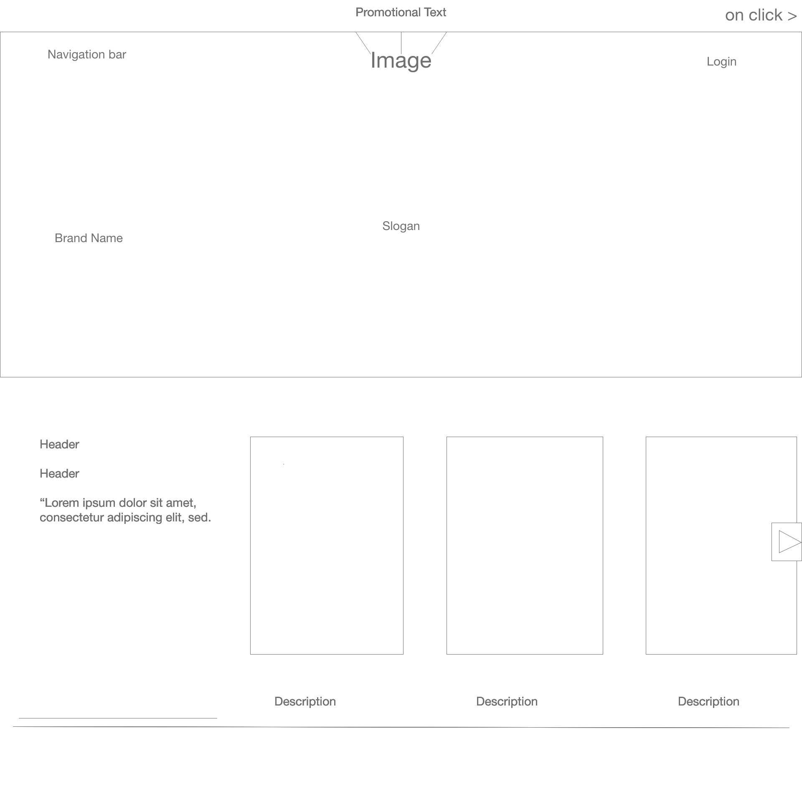
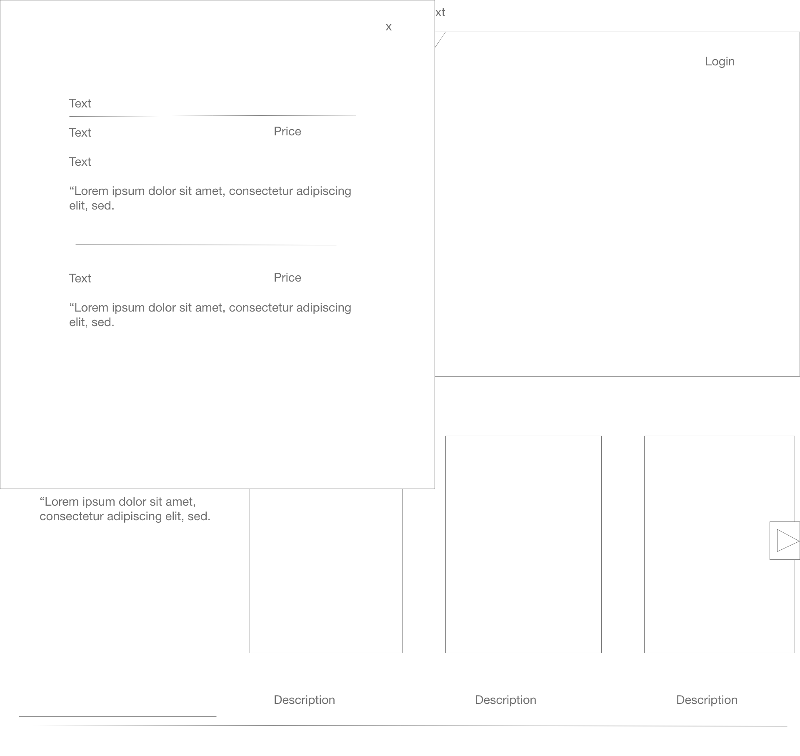
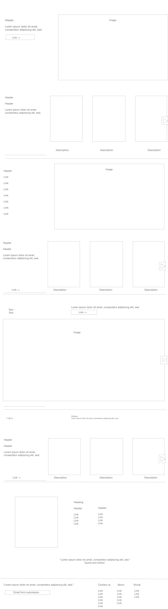

Using a started code our group was able to recreate [Aesop's Website](https://www.aesop.com/us/) by 

1. Designating a leader to fork a starter code.
2. Adding all teammates as collaborators.
3. Each team member creating their own branch. 
4. Assign tasks amongst each other.

Wireframe for Aesop website created in Adobe XD 

